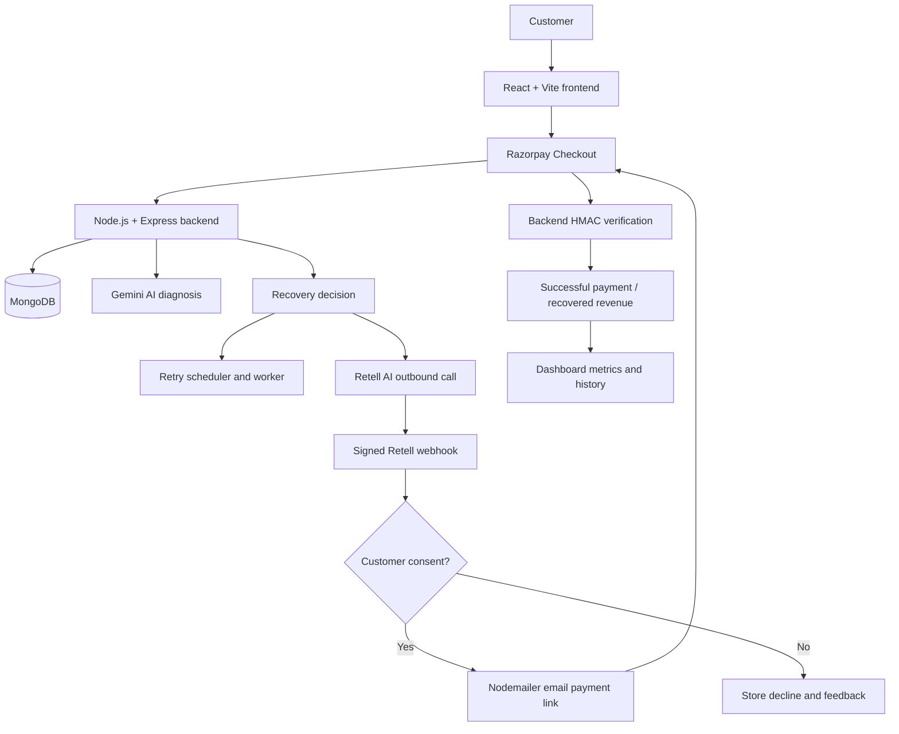

# AI Revenue Recovery

AI Revenue Recovery is a Razorpay AI Buildathon 2026, Track 03 project that identifies payment revenue at risk, diagnoses failed or abandoned checkout context with Gemini, chooses a bounded recovery action, and records recovery only after Razorpay confirms a successful payment. The application combines retry scheduling, Retell AI voice recovery, consent-based email payment links, and a dashboard for revenue-at-risk and recovered-revenue visibility.

## Problem Statement

Payment failures and abandoned checkout sessions create revenue leakage. A customer may intend to pay but leave because of a temporary payment issue, uncertainty, or an incomplete checkout. Detecting a failed payment is only the first step: a recovery system must decide whether to retry, contact the customer, or stop, and it must avoid unlimited attempts or falsely counting a conversation as revenue.

This project provides an automated, bounded workflow around those decisions. It stores payment and recovery history, uses AI to analyze the context, and considers money recovered only after a successful Razorpay payment is verified.

## Solution

The implemented flow is:

1. Detect a failed payment or abandoned checkout.
2. Send the payment and failure context to Gemini for diagnosis.
3. Select a recovery action such as `TRY_LATER` or `CONTACT_CUSTOMER`.
4. Schedule a bounded retry or initiate a recovery call when appropriate.
5. Use Retell AI for outbound voice recovery when the selected action is customer contact.
6. Process the customer response and require explicit consent before sending a recovery payment link.
7. Send the link through email after consent.
8. Let the customer complete payment through Razorpay Checkout.
9. Verify the Razorpay order, payment ID, and HMAC signature on the backend.
10. Mark the payment successful and recovered only when verification succeeds.
11. Update dashboard metrics and the stored payment, diagnosis, call, consent, and recovery history.

A customer saying “yes” is not treated as recovered revenue. Recovery is attributed only after a real successful Razorpay payment passes backend verification.

## Key Features

- **AI payment diagnosis:** Gemini receives the stored payment context and produces a JSON diagnosis, root cause, confidence, recovery probability, suggested action, retry delay, customer message, reasoning, and risk level.
- **AI-selected recovery action:** The backend stores the current recommendation and preserves prior recommendations in `aiDiagnosisHistory`. Failed attempted payments are forced to `TRY_LATER`; abandoned checkouts can be diagnosed for customer contact.
- **Bounded retry scheduling:** Customers can schedule retries in seconds, minutes, or hours. The retry worker checks due payments every 10 seconds, creates a new Razorpay order, and limits retries to two through the current service configuration.
- **Razorpay checkout and verification:** The frontend opens Razorpay Checkout, reports failures, and sends successful Checkout responses to the backend for HMAC verification.
- **Previous payment preference on retry:** Retry Checkout receives the stored payment method and, for Netbanking, the stored bank as a display preference. The customer still authorizes the payment in Checkout.
- **Retell AI outbound calling:** Recovery calls are created with the payment ID and customer phone context through Retell’s API.
- **Consent-based email recovery:** A signed Retell analysis can record consent, after which the backend sends an email containing a payment link.
- **Customer response tracking:** Call outcome, consent, decline reason, optional feedback, call status, and recovery channel are stored.
- **Recovery status tracking:** Payment status, failure history, retry history, call state, email state, and verification fields are retained in MongoDB.
- **Dashboard analytics:** The dashboard displays total payment volume, revenue at risk, recovered revenue, recovery rate, failed payments, recovered count, recent activity, AI recommendations, and recovery/call details.
- **Webhook idempotency:** Retell analyzed events are deduplicated using an `event:call_id` key.
- **Email verification:** Customers must verify their email before a payment order can be created.

## System Architecture



Component roles:

- **React/Vite:** Provides payment entry, email verification state, Razorpay Checkout integration, retry scheduling UI, recovery-link handling, and dashboard rendering.
- **Node.js/Express:** Owns payment order creation, failure handling, AI diagnosis, retry scheduling, verification, recovery calls, webhook processing, and dashboard aggregation.
- **MongoDB/Mongoose:** Stores payments, verification tokens, retry and failure history, AI recommendations, call outcomes, consent, and recovery state.
- **Gemini:** Diagnoses the payment context and recommends a recovery action; it does not process payments.
- **Razorpay:** Creates orders, hosts Checkout, and supplies payment responses that the backend verifies.
- **Retell AI:** Places recovery calls and returns signed call-analysis webhooks.
- **Nodemailer/Gmail:** Sends email-verification messages and consent-approved recovery payment links.

## Recovery Workflow

### Failed Payment

1. Razorpay Checkout emits `payment.failed`.
2. The frontend reports the Razorpay order, failure reason, payment method, and available payment ID.
3. The backend stores the failure and, when needed, fetches the real Razorpay payment details to retain the method and bank.
4. Gemini diagnoses the payment. When `paymentAttempted` is true, the backend enforces `TRY_LATER`.
5. The customer schedules a retry, or the current retry flow is continued.
6. The worker claims due retries, creates a new Razorpay order, preserves retry metadata, and the frontend opens genuine Razorpay Checkout.
7. The customer completes or abandons the retry Checkout.
8. Successful responses go through backend Razorpay signature verification. Only a verified success becomes `SUCCESS`; retry or recovery payments are marked recovered through the existing attribution logic.

### Voice Recovery

The abandoned-checkout path can diagnose a payment with `paymentAttempted: false` and `checkoutAbandoned: true`. When the action is `CONTACT_CUSTOMER`, the backend starts a Retell outbound call.

The Retell agent receives a payment ID and customer phone context. Its signed `call_analyzed` webhook supplies the configured custom analysis fields:

- `email_consent`
- `outcome`
- `decline_reason`
- `feedback_comment`

If consent is `true`, the backend stores the consent and sends a recovery email containing a frontend payment link. The customer must still complete the Razorpay payment and pass verification before revenue is recovered.

If consent is `false`, the system stores the response, decline reason, and feedback without marking revenue recovered. Other outcomes such as `already_paid`, `opted_out`, `voicemail`, and `unreachable` are stored in `callOutcome` when provided by Retell.

## AI Decision Making

Gemini is initialized in `Backend/services/aiService.js` using `GEMINI_API_KEY` and `GEMINI_MODEL`. `diagnosePayment(payment)` serializes the payment context into a prompt containing:

- Amount and currency
- Payment status
- Failure reason
- Retry counters and payment-attempt state
- Abandonment context when applicable
- Stored recovery context included in the payment object

The prompt asks for valid JSON containing `diagnosis`, `rootCause`, `confidence`, `recoveryProbability`, `recommendedAction`, `retryAfterMinutes`, `customerMessage`, `reasoning`, and `riskLevel`. The controller stores the current result in `aiRecommendation` and appends the result to `aiDiagnosisHistory`.

Gemini does not create Razorpay orders, charge customers, verify signatures, place calls, or send email. Those actions remain in the backend services and controllers.

## Voice Agent

`Backend/services/retellService.js` calls Retell’s `create-phone-call` endpoint. The request includes the configured Retell agent and outbound number, plus the payment ID and customer phone as dynamic variables and metadata.

`POST /api/recovery/retell-webhook`:

- Requires `x-retell-signature` and verifies the raw request body with the Retell API key.
- Processes `call_analyzed` events and ignores other event types.
- Extracts the call ID, payment ID, and custom analysis data.
- Records call status, outcome, consent, decline reason, feedback, and recovery channel.
- Uses `event:call_id` in `processedWebhookEvents` to prevent duplicate processing.
- Sends a recovery email only when `email_consent === true` and one has not already been sent.

Secrets, agent IDs, phone numbers, and API keys are configured through environment variables and are not part of this README.

## Payment Recovery and Verification

The payment lifecycle is split into distinct stages:

1. `POST /api/payment/create-order` validates the customer input and verified email, creates a Razorpay order, and stores a pending `Payment` document.
2. The React frontend opens Razorpay Checkout using the returned order.
3. Razorpay returns either a success response or a failure event to the browser.
4. `POST /api/payment/verify` recomputes the HMAC from `razorpay_order_id|razorpay_payment_id` using `RAZORPAY_KEY_SECRET`.
5. Only a matching signature updates the payment to `SUCCESS`, stores the Razorpay payment ID/signature, and calculates the existing `recovered` flag.
6. Dashboard recovered revenue includes `SUCCESS` payments with `recovered: true`.

The project does not count call consent, email delivery, a created retry order, or a customer intention as payment recovery.

## Dashboard

The `/dashboard` frontend route loads `GET /api/payment/dashboard`. The backend currently calculates:

- `totalPayments`: number of payment documents.
- `totalPaymentVolume`: sum of all payment amounts.
- `revenueAtRisk`: sum of `FAILED`, `RETRYING`, `WAITING_FOR_RETRY`, and `PENDING` payments.
- `recoveredRevenue`: sum of `SUCCESS` payments where `recovered` is true.
- `recoveredCount`: count of successfully recovered payments.
- `recoveryRate`: recovered count divided by documents containing at least one failure-history entry.
- `failedPayments`: count of payments currently in `FAILED` status.
- `totalFailedPayments`: count of payments with at least one `failureHistory` entry.
- `recentPayments`: the latest 10 payment records with payment, AI, call, consent, email, and feedback fields.

The dashboard presents KPI cards, revenue-at-risk payments, AI diagnosis cards, recent transactions, retry counts, payment status, recovery state, call state, customer responses, decline reasons, and feedback.

## Tech Stack

| Area | Technology |
|---|---|
| Frontend | React 19, React Router, Axios, Vite |
| Backend | Node.js, Express 5, CommonJS |
| Database | MongoDB with Mongoose |
| AI | Google Generative AI SDK with Gemini |
| Payments | Razorpay Node SDK and Razorpay Web Standard Checkout |
| Voice AI | Retell AI API and signed webhooks |
| Email | Nodemailer with Gmail transport |
| Scheduling/background processing | In-process retry worker using `setInterval` every 10 seconds |
| Development tools | npm, Vite, Oxlint, dotenv |

## Project Structure

```text
AIRevenueRecovery/
├── Backend/
│   ├── controllers/
│   │   ├── authController.js
│   │   ├── paymentController.js
│   │   └── recoveryController.js
│   ├── middleware/
│   │   └── validation.js
│   ├── models/
│   │   ├── Payment.js
│   │   └── Verification.js
│   ├── routes/
│   │   ├── authRoutes.js
│   │   ├── paymentRoutes.js
│   │   └── recoveryRoutes.js
│   ├── services/
│   │   ├── aiService.js
│   │   ├── emailService.js
│   │   ├── paymentService.js
│   │   ├── qrService.js
│   │   ├── retellService.js
│   │   └── retryService.js
│   ├── utils/constants.js
│   ├── workers/
│   │   ├── paymentWorker.js
│   │   └── retryWorker.js
│   ├── .env.example
│   ├── package-lock.json
│   ├── package.json
│   └── server.js
├── Frontend/
│   ├── public/
│   │   ├── favicon.svg
│   │   └── icons.svg
│   ├── src/
│   │   ├── assets/
│   │   │   ├── hero.png
│   │   │   ├── react.svg
│   │   │   └── vite.svg
│   │   ├── components/
│   │   │   ├── PaymentForm.jsx
│   │   │   ├── QRCodeDisplay.jsx
│   │   │   └── StatusBadge.jsx
│   │   ├── hooks/usePayment.js
│   │   ├── pages/
│   │   │   ├── Dashboard.css
│   │   │   ├── Dashboard.jsx
│   │   │   └── HomePage.jsx
│   │   ├── services/api.js
│   │   ├── styles/index.css
│   │   ├── App.css
│   │   ├── App.jsx
│   │   ├── index.css
│   │   └── main.jsx
│   ├── .env.example
│   ├── README.md
│   ├── index.html
│   ├── package-lock.json
│   ├── package.json
│   └── vite.config.js
└── README.md
```

Important directories:

- `Backend/controllers`: HTTP request handlers and workflow orchestration.
- `Backend/services`: integrations and retry/order services.
- `Backend/models`: Mongoose schemas for payments and email verification.
- `Backend/workers`: the active retry worker and an empty payment-worker placeholder.
- `Frontend/src/pages`: payment/recovery page and dashboard.
- `Frontend/src/services/api.js`: Axios API client.

Some scaffolded files exist but are currently empty or unused, including `qrService.js`, `paymentWorker.js`, `validation.js`, `constants.js`, `usePayment.js`, `PaymentForm.jsx`, `QRCodeDisplay.jsx`, and `StatusBadge.jsx`. They are not presented as implemented features.

## Installation and Setup

### Prerequisites

- Node.js and npm.
- A MongoDB database reachable through `MONGO_URI`.
- Razorpay Test Mode account and API keys.
- Gemini API key.
- Gmail credentials usable by Nodemailer.
- Retell AI API key, agent ID, and outbound phone number if voice recovery is enabled.

### Clone

Use your repository URL in place of the placeholder:

```bash
git clone <your-repository-url>
cd AIRevenueRecovery
```

### Backend Setup

```bash
cd Backend
npm install
copy .env.example .env
node server.js
```

On macOS/Linux, use `cp .env.example .env` instead of `copy`. The backend listens on `PORT`, defaulting to port `5000`. It connects to MongoDB and starts the retry worker after the connection succeeds.

The checked-in `Backend/.env.example` documents the public URL and Retell variables, but the implementation also requires the MongoDB, Razorpay, Gemini, and email variables listed in the environment table below. Add those values to `Backend/.env` without committing secrets.

### Frontend Setup

```bash
cd Frontend
npm install
copy .env.example .env
npm run dev
```

On macOS/Linux, use `cp .env.example .env`. Set `VITE_API_URL` to the backend API base URL and add `VITE_RAZORPAY_KEY_ID` for Checkout. The frontend defaults to `http://localhost:5000/api` when `VITE_API_URL` is not set. Vite normally serves the frontend at `http://localhost:5173`.

Available frontend scripts:

```bash
npm run dev
npm run build
npm run lint
npm run preview
```

The backend package does not define a start script; use `node server.js` from `Backend`.

### External Services

- **Razorpay:** Create Test Mode keys, set the backend key ID/secret, and expose the public key to the frontend as `VITE_RAZORPAY_KEY_ID`. The frontend loads Standard Checkout from Razorpay’s hosted script.
- **Gemini:** Create an API key and set `GEMINI_API_KEY`. Optionally set `GEMINI_MODEL`; the service defaults to `gemini-2.5-flash-lite` when it is absent.
- **Retell AI:** Set the API key, agent ID, and outbound phone number. Configure Retell to send analyzed-call webhooks to `/api/recovery/retell-webhook` with the expected custom analysis fields.
- **Gmail/Nodemailer:** Set `EMAIL_USER` and `EMAIL_PASS`. `EMAIL_FROM` is optional and falls back to `EMAIL_USER`.
- **MongoDB:** Set `MONGO_URI` to a MongoDB connection string. The backend starts its retry worker after a successful connection.

## Environment Variables

Values below are names only; do not copy secrets into source control.

| Variable | Purpose | Required |
|---|---|---|
| `MONGO_URI` | MongoDB connection string used by Mongoose | Yes |
| `PORT` | Backend HTTP port; defaults to `5000` | No |
| `BACKEND_URL` | Base backend URL used in email verification links | Yes |
| `FRONTEND_URL` | Frontend URL used for verification redirects and recovery links | Yes |
| `RAZORPAY_KEY_ID` | Razorpay server SDK key ID | Yes |
| `RAZORPAY_KEY_SECRET` | Razorpay server SDK secret and HMAC verification secret | Yes |
| `VITE_RAZORPAY_KEY_ID` | Razorpay public Checkout key exposed to the frontend build | Yes |
| `GEMINI_API_KEY` | Google Generative AI credential | Yes |
| `GEMINI_MODEL` | Gemini model name; backend has a default | No |
| `EMAIL_USER` | Gmail/Nodemailer sender account | Yes |
| `EMAIL_PASS` | Gmail/Nodemailer credential or app password | Yes |
| `EMAIL_FROM` | Optional recovery-email sender address | No |
| `RETELL_API_KEY` | Retell API and webhook verification credential | Required for voice recovery/webhook |
| `RETELL_AGENT_ID` | Retell agent used for outbound calls | Required for voice recovery |
| `RETELL_PHONE_NUMBER` | Retell outbound caller number | Required for voice recovery |

`Backend/.env.example` currently contains `BACKEND_URL`, `FRONTEND_URL`, `RETELL_API_KEY`, `RETELL_AGENT_ID`, and `RETELL_PHONE_NUMBER`. `Frontend/.env.example` contains `VITE_API_URL`. The additional variables above are required by the implementation but are not all represented in the example files.

## API Endpoints

The backend base URL is normally `http://localhost:5000`. Responses are JSON unless noted.

### Health and Authentication

| Method | Endpoint | Purpose | Request | Response |
|---|---|---|---|---|
| `GET` | `/` | Health check and MongoDB state | None | API message and database state |
| `POST` | `/api/auth/send-verification` | Create a 15-minute email-verification token and send email | `{ email }` | Verification message |
| `GET` | `/api/auth/verify-email?token=...` | Validate token and mark email verified | Query `token` | Redirects to frontend with verification query parameters |

### Payments and Recovery Scheduling

| Method | Endpoint | Purpose | Important request | Important response |
|---|---|---|---|---|
| `POST` | `/api/payment/create-order` | Validate verified email and create Razorpay order/payment record | `{ amount, email, phone }` | `{ success, order, paymentId }` |
| `POST` | `/api/payment/verify` | Verify Razorpay HMAC and complete payment | `razorpay_order_id`, `razorpay_payment_id`, `razorpay_signature` | Verified payment document |
| `POST` | `/api/payment/failed` | Store failure, diagnose it, and possibly initiate contact recovery | `razorpay_order_id`, `reason`, optional `payment_method`, `payment_id` | Updated payment with diagnosis |
| `POST` | `/api/payment/checkout-abandoned` | Diagnose checkout dismissed without a payment attempt | `razorpay_order_id` | Updated payment and possible call state |
| `POST` | `/api/payment/:paymentId/schedule-retry` | Schedule a bounded retry | `{ retryAfter, retryUnit }`, where unit is `SECONDS`, `MINUTES`, or `HOURS` | Scheduled payment |
| `POST` | `/api/payment/abort-retry` | Stop a pending retry | `{ paymentId }` | Aborted payment |
| `GET` | `/api/payment/status/:paymentId` | Read status and Checkout order data | Path `paymentId` | Payment state and order object |
| `GET` | `/api/payment/dashboard` | Load dashboard aggregates and latest 10 payments | None | `stats` and `recentPayments` |
| `GET` | `/api/payment/test-ai` | Run a hard-coded Gemini diagnosis test | None | Test diagnosis |
| `GET` | `/api/payment/test-failed-payment` | Create and diagnose a test failed payment document | None | Test payment and diagnosis |

### Voice Recovery

| Method | Endpoint | Purpose | Important request | Important response |
|---|---|---|---|---|
| `POST` | `/api/recovery/call/:paymentId` | Manually initiate a Retell recovery call | Path `paymentId` | Call ID and initiation status |
| `POST` | `/api/recovery/retell-webhook` | Verify and process Retell call analysis | Signed JSON body; `call_analyzed` event | Processing status |

## Retell Webhook

The webhook requires the `x-retell-signature` header, the raw request body, and `RETELL_API_KEY`. The handler verifies the signature before processing. It accepts `call_analyzed` events, resolves the payment ID from call metadata or dynamic variables, and reads `custom_analysis_data`.

The webhook stores call ID, completed status, outcome, consent, decline reason, feedback, and recovery channel. A processed event key is stored so a repeated `event:call_id` is acknowledged without applying the update twice. When `email_consent` is true and no recovery email has been sent, Nodemailer sends the customer a payment link containing the payment ID.

## Data Model

### `Payment`

The main recovery entity contains:

- **Identity and amount:** `email`, `phone`, `amount`, `currency`.
- **Razorpay state:** `razorpayOrderId`, `razorpayPaymentId`, `razorpaySignature`, `paymentMethod`, `paymentBank`.
- **Status:** `PENDING`, `PROCESSING`, `SUCCESS`, `FAILED`, `RETRYING`, `WAITING_FOR_RETRY`, `ABORTED`, or `EXPIRED`.
- **Attempt history:** `paymentAttempted`, `retryCount`, `maxRetries`, `orderHistory`, `failureHistory`.
- **Timing and control:** `expiresAt`, `lastAttemptAt`, `nextRetryAt`, `abortRequested`, `completedAt`.
- **Recovery:** `recovered`, `recoveryChannel`, `recoveryEmailSent`, `incompleteEmailSent`.
- **Call and consent:** `callStatus`, `callId`, `callResponse`, `callOutcome`, `customerAcceptedRecovery`.
- **Customer feedback:** `declineReason`, `feedback`.
- **AI:** `aiRecommendation`, `aiDiagnosisHistory`.
- **Idempotency/reminders:** `processedWebhookEvents`, `lastReminderAt`, `reminderCount`.

### `Verification`

Email verification records contain `email`, a random `token`, `expiresAt`, `verified`, and Mongoose timestamps.

## Safety, Compliance and Guardrails

Implemented safeguards include:

- Gemini is instructed not to expose sensitive payment information and does not handle card or bank credentials.
- The voice workflow stores consent separately and sends a recovery link only after `email_consent === true`.
- Declines, opt-out outcomes, voicemail, unreachable calls, and feedback are retained rather than treated as successful recovery.
- Razorpay success is determined by backend HMAC verification, not by a customer statement or frontend status alone.
- Retry scheduling is bounded by `MAX_RETRIES`/`maxRetries` and the active worker query.
- Failure history, order history, AI diagnosis history, webhook event keys, call state, and email state provide an audit trail.
- Email-verification links expire after 15 minutes.

This project does not claim legal or compliance certification. The current code also lacks authentication/authorization middleware, has unrestricted CORS, exposes test endpoints, and depends on browser callbacks rather than a server-side Razorpay webhook. These are important production hardening gaps.

## Demo Flow

1. Start MongoDB and the backend/frontend services.
2. Enter an email and request verification.
3. Open the verification email and return to the payment page.
4. Enter a phone number and amount.
5. Create a Razorpay Test Mode order.
6. Complete or intentionally fail Checkout.
7. For a failed payment, inspect the Gemini diagnosis and selected recovery action.
8. Schedule a short retry interval for a demo.
9. Let the retry worker create the next order and open Checkout.
10. For an abandoned checkout, trigger or observe the Retell recovery-call path when configured.
11. In a consented call-analysis flow, verify that the email payment link is sent.
12. Open the payment link or retry Checkout and complete the Razorpay test payment.
13. Confirm backend verification returns success.
14. Refresh `/dashboard` and inspect recovered revenue, recovery rate, status, and history.

Decline scenario: send a Retell `call_analyzed` payload with `email_consent: false`, an appropriate `outcome`, optional `decline_reason`, and `feedback_comment`. The payment should retain the response without being marked as recovered.

## Example Recovery Scenario

**Example/demo scenario, not production data:**

A customer attempts an INR 100 payment and Razorpay reports a temporary failure. The backend stores the failure and Gemini recommends `TRY_LATER`. The customer schedules a retry, the worker creates a new Razorpay order, and Checkout opens again. The customer completes the test payment, the backend verifies the Razorpay signature, and the dashboard records INR 100 as recovered because the payment is now `SUCCESS` with `recovered: true`.

For an abandoned checkout, a configured `CONTACT_CUSTOMER` decision can start a Retell call. If the customer consents to receiving a link, the link is emailed; consent alone does not change the recovered-revenue total.

## Limitations

- Razorpay is configured for Test Mode in the supplied project environment; test payments do not represent real funds.
- Retry execution creates a new Razorpay order and opens Checkout for customer authorization. It is not a reusable-card auto-charge or mandate-based charge.
- The frontend relies on Razorpay browser callbacks for success/failure reporting. No Razorpay server webhook is implemented.
- Retry worker state is in-process and runs through `setInterval`; it is not a durable queue or distributed scheduler.
- The backend package has no test script beyond the placeholder npm command.
- Gemini output is parsed as JSON without schema validation or a structured fallback.
- Retell/email operations do not have a durable job queue for retries.
- Dashboard recovery-rate semantics use failed-history documents as the denominator and may not match every business definition of recovery rate.
- `revenueAtRisk` includes `PENDING` payments and excludes `ABORTED` and `EXPIRED` statuses.
- Abandoned checkout remains `PENDING`, while retry scheduling currently requires `FAILED`; the UI and endpoint can therefore disagree for some abandoned-payment cases.
- No QR-payment, WebSocket, reminder worker, or reusable payment-component flow is active in the current code.
- The current API has no authentication or authorization layer, and test endpoints are publicly reachable if the server is exposed.

## Future Improvements

- Add durable queues and distributed worker coordination for retries, calls, and emails.
- Add Razorpay webhooks and idempotent server-side payment-state reconciliation.
- Use mandates, tokens, or subscriptions where eligible for compliant automatic retries instead of attempting to reuse Checkout authorization.
- Add authentication and authorization for dashboard, test, status, retry, and recovery endpoints.
- Validate Gemini responses against a schema and add fallback behavior.
- Improve policy optimization with customer segmentation, experimentation, and action-level attribution.
- Expand recovery channels and add production-grade notification preferences.
- Refine recovery-rate definitions and add cohort, channel, and time-to-recovery analytics.
- Add automated tests for controllers, webhook idempotency, retry boundaries, and signature verification.

## Screenshots

The repository does not currently contain these screenshot files. Add captured project screenshots under `docs/` before submission if desired:

```markdown


```

## Buildathon Relevance

This project maps to Razorpay AI Buildathon 2026, Track 03 – AI Revenue Recovery as follows:

- **Detect revenue at risk:** Stores failed, pending, retrying, and abandoned-checkout payment context.
- **Determine intervention:** Gemini produces diagnosis, risk, recovery probability, retry delay, and a recovery action.
- **Execute recovery:** Uses bounded retry scheduling, Razorpay Checkout, Retell outbound calling, and consent-based email links.
- **Measure recovered money:** Counts recovered revenue only for verified successful payments with `recovered: true`.
- **Stop or bound recovery:** Uses retry limits, `abortRequested`, `ABORTED` status, opt-out/decline recording, and worker query guards.
- **Maintain an audit trail:** Stores payment attempts, order history, failure history, AI diagnosis history, call metadata, consent, feedback, email state, and webhook event keys.
- **Customer-safe recovery:** Does not ask the voice agent to collect payment credentials, requires consent before recovery-email delivery, and keeps payment authorization in Razorpay Checkout.

## Demo Credentials / Test Mode

Use Razorpay Test Mode keys for evaluation. The repository’s local environment includes test-oriented Razorpay configuration, but actual secret values are intentionally excluded from this README. Do not commit `.env` files or expose `RAZORPAY_KEY_SECRET`, `GEMINI_API_KEY`, `RETELL_API_KEY`, Gmail credentials, MongoDB credentials, or other secrets.

The backend also exposes `/api/payment/test-ai` and `/api/payment/test-failed-payment` for development demonstrations. These endpoints create or process data and should not be exposed without protection in a production deployment.

## License

No repository license file was found. Licensing terms should be added separately before distribution.
